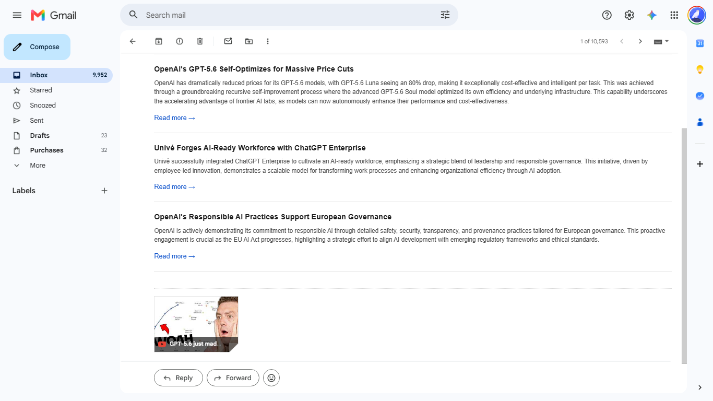
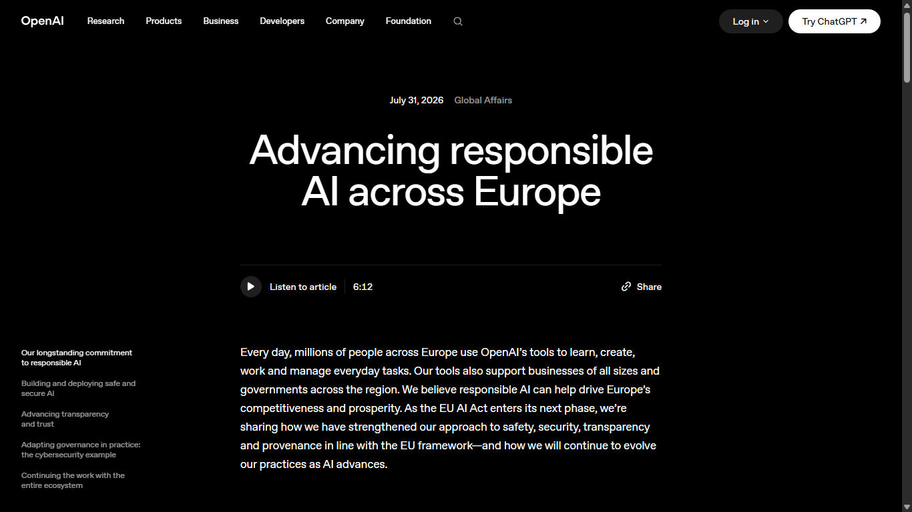
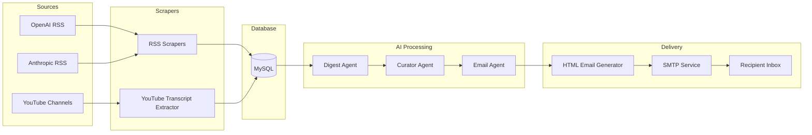
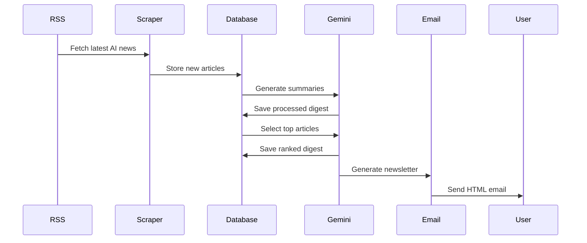

# AI News Aggregator

<p align="center">


</p>

An end-to-end AI-powered news aggregation platform that automatically collects the latest AI news from trusted sources, processes and summarizes the content using Google's Gemini models, ranks articles based on relevance, and delivers a curated daily newsletter directly to users via email.

The project is designed with a modular architecture, making it easy to extend with additional news sources, AI models, databases, or delivery channels. It demonstrates the practical integration of Large Language Models (LLMs), RSS feeds, structured data processing, database management, and automated email generation within a production-style workflow.

---
# Newsletter Preview

## Daily AI Newsletter

### Newsletter Overview

<p align="center">
    
</p>

---

### Top Articles Section

<p align="center">
    
</p>

---
## Table of Contents

- Features
- Newsletter Preview
- Architecture
- Technology Stack
- Project Structure
- Installation
- Configuration
- Usage
- Future Improvements
- License

---

## Features

### News Aggregation

- Collects AI news from multiple trusted RSS feeds.
- Extracts and processes YouTube video transcripts.
- Prevents duplicate articles from being stored.
- Maintains a structured repository of news articles.

### AI Processing

- Generates concise and informative summaries using **Google Gemini 2.5 Flash**.
- Produces structured JSON responses with Pydantic validation.
- Automatically ranks and prioritizes the most relevant news.
- Generates a human-readable introduction for each newsletter.

### Database Management

- Stores articles, summaries, digests, and rankings in **MySQL**.
- Uses **SQLAlchemy ORM** for clean database interactions.
- Repository pattern for maintainable data access.
- Efficient querying of newly collected articles.

### Email Newsletter

- Generates responsive HTML email newsletters.
- Sends curated daily digests using SMTP.
- Includes ranked articles with summaries and source links.
- Designed for automated daily delivery.

### Modular Architecture

- Independent AI agents for different responsibilities.
- Separate modules for scraping, processing, database operations, and email generation.
- Easily extensible to support additional news sources or LLM providers.
- Clean separation of business logic and infrastructure.

### Developer Friendly

- Environment variable based configuration.
- Modular folder structure.
- Easy local setup using Python virtual environments.
- Ready for Dockerization and cloud deployment.

---

# System Architecture

The application follows a modular pipeline where each component is responsible for a single task. Raw news is collected from multiple sources, processed using AI agents, stored in a MySQL database, and finally delivered as a curated email newsletter.



---

# Pipeline Workflow

The following sequence illustrates the complete execution flow of the daily news aggregation pipeline.



---

# AI Agents

The project follows an agent-based architecture where each AI agent performs a dedicated responsibility.

| Agent | Responsibility |
|--------|----------------|
| **Digest Agent** | Generates concise summaries of collected articles using Gemini 2.5 Flash. |
| **Curator Agent** | Selects and ranks the most relevant news articles for the daily digest. |
| **Email Agent** | Creates a professional introduction and newsletter content for email delivery. |

This separation of responsibilities keeps the system modular, easier to maintain, and allows individual agents to be upgraded independently.

---

# Technology Stack

| Category | Technologies |
|-----------|--------------|
| **Programming Language** | Python 3.12 |
| **Large Language Model** | Google Gemini 2.5 Flash |
| **Database** | MySQL |
| **ORM** | SQLAlchemy |
| **Data Validation** | Pydantic |
| **AI SDK** | Google GenAI SDK |
| **News Sources** | RSS Feeds |
| **Video Processing** | YouTube Transcript API |
| **Email Service** | SMTP |
| **Configuration** | Python Dotenv |
| **HTML Generation** | Markdown + HTML |
| **Version Control** | Git & GitHub |
| **Deployment (Planned)** | Docker, Render |

---

# Design Principles

The project is built around several software engineering principles:

- Modular architecture with clear separation of concerns.
- Repository Pattern for database abstraction.
- AI agent-based workflow for content generation.
- Environment-based configuration management.
- Structured data validation using Pydantic.
- Reusable services for email generation and database operations.
- Scalable architecture for integrating additional news sources and AI providers.

---

# Data Flow

```text
RSS Sources / YouTube
          │
          ▼
     Data Collection
          │
          ▼
    Store in MySQL Database
          │
          ▼
     Gemini Digest Agent
          │
          ▼
     Curator Agent
          │
          ▼
      Email Agent
          │
          ▼
    HTML Email Generation
          │
          ▼
      SMTP Email Delivery
```

---

# Project Structure

```text
ai-news-aggregator-me/
│
├── app/
│   ├── agent/                 # Gemini-powered AI agents
│   │   ├── curator_agent.py
│   │   ├── digest_agent.py
│   │   └── email_agent.py
│   │
│   ├── database/              # Database configuration and repository
│   │   ├── connection.py
│   │   ├── create_tables.py
│   │   ├── models.py
│   │   └── repository.py
│   │
│   ├── profiles/              # User profile configuration
│   │   └── user_profile.py
│   │
│   ├── scrapers/              # News collection modules
│   │   ├── anthropic.py
│   │   ├── openai.py
│   │   └── youtube.py
│   │
│   ├── services/              # Business logic
│   │   ├── email.py
│   │   ├── process_anthropic.py
│   │   ├── process_curator.py
│   │   ├── process_digest.py
│   │   ├── process_email.py
│   │   └── process_youtube.py
│   │
│   ├── config.py
│   ├── runner.py
│   └── daily_runner.py
│
├── docker/                    # Docker configuration (planned)
├── main.py                    # Application entry point
├── requirements.txt
├── README.md
├── .env.example
└── .gitignore
```

---

# Installation

### Clone the repository

```bash
git clone https://github.com/<your-username>/ai-news-aggregator-me.git

cd ai-news-aggregator-me
```

---

### Create a virtual environment

**Windows**

```bash
python -m venv .venv

.venv\Scripts\activate
```

**Linux / macOS**

```bash
python3 -m venv .venv

source .venv/bin/activate
```

---

### Install dependencies

```bash
pip install -r requirements.txt
```

---

# Configuration

Create a `.env` file in the project root and configure the following environment variables.

```env
# Google Gemini

GEMINI_API_KEY=your_gemini_api_key

# MySQL

MYSQL_HOST=localhost
MYSQL_PORT=3306
MYSQL_USER=root
MYSQL_PASSWORD=your_password
MYSQL_DATABASE=ai_news

# Email Configuration

MY_EMAIL=your_email@gmail.com
APP_PASSWORD=your_gmail_app_password
```

> **Note:** Never commit your `.env` file to version control. Use `.env.example` as a template for sharing configuration.

---

# Database Setup

Create the required database.

```sql
CREATE DATABASE ai_news;
```

Once the database is created, initialize the tables.

```bash
python -m app.database.create_tables
```

---

# Running the Application

Run the complete daily news aggregation pipeline.

```bash
python main.py
```

By default, the pipeline:

- Collects news from the last **24 hours**
- Selects the **Top 10** articles
- Generates summaries
- Ranks articles
- Creates an HTML newsletter
- Sends the email

---

### Custom Parameters

Specify a custom time window and number of top articles.

```bash
python main.py <hours> <top_n>
```

Example:

```bash
python main.py 48 15
```

This command processes articles from the last **48 hours** and includes the **Top 15** ranked articles in the newsletter.

---

# Required Python Packages

Install all dependencies using:

```bash
pip install -r requirements.txt
```

Major libraries used in this project include:

- google-genai
- SQLAlchemy
- Pydantic
- feedparser
- python-dotenv
- markdown
- youtube-transcript-api
- mysql-connector-python

---

# Configuration Notes

- Google Gemini is used for all AI-powered processing.
- MySQL stores articles, summaries, rankings, and generated digests.
- SMTP is used for newsletter delivery.
- Environment variables are managed using `python-dotenv`.
- The project entry point is `main.py`, making deployment straightforward on cloud platforms such as Render.

---

# Usage

Once the project is configured, run the pipeline using:

```bash
python main.py
```

The application performs the following steps:

1. Fetches the latest AI news from configured RSS feeds and YouTube sources.
2. Stores newly discovered articles in the MySQL database.
3. Generates concise summaries using Google Gemini.
4. Ranks articles based on relevance and importance.
5. Creates a professionally formatted HTML newsletter.
6. Sends the newsletter to the configured recipient via SMTP.

---

# Pipeline Overview

```text
Fetch News
     │
     ▼
Store Articles
     │
     ▼
Generate Summaries
     │
     ▼
Rank Articles
     │
     ▼
Generate HTML Newsletter
     │
     ▼
Send Email
```

---

# Sample Output

After successful execution, the console output is similar to:

```text
============================================================
           AI NEWS DAILY PIPELINE
============================================================

✓ Fetching RSS articles...
✓ Processing new articles...
✓ Generating AI summaries...
✓ Ranking top articles...
✓ Creating HTML newsletter...
✓ Sending email...

============================================================
Pipeline completed successfully.
Processed Articles : 18
Top Articles       : 10
Newsletter Sent    : Yes
============================================================
```

---

# Newsletter Preview

The generated newsletter contains:

- AI-generated introduction
- Top ranked AI news
- Concise article summaries
- Source links
- Clean HTML formatting
- Responsive email layout

---


# Key Highlights

- Automated end-to-end AI news aggregation.
- Structured AI-generated summaries.
- Intelligent article ranking using Gemini.
- Professional HTML email generation.
- Modular architecture with reusable components.
- MySQL-backed persistent storage.
- Production-ready project structure.
- Easily extensible with additional news sources and AI providers.

---

# 🚀 Future Enhancements

The project has been designed with extensibility in mind. Planned improvements include:

- Multi-user support with personalized AI news digests.
- User authentication and profile management.
- Category-based newsletters (AI, Technology, Finance, Politics, Sports, etc.).
- Automated scheduling using Render Cron Jobs or GitHub Actions.
- Docker containerization for simplified deployment.
- REST API for external integrations.
- Interactive web dashboard for viewing and managing newsletters.
- Admin analytics and newsletter performance tracking.
- Slack and Discord notification support.
- Semantic search using Vector Databases.
- Retrieval-Augmented Generation (RAG) for enhanced news summarization.
- Support for additional LLM providers such as OpenAI and Anthropic.
- Document ingestion using Docling for AI-powered document analysis.

---

# 🤝 Contributing

Contributions are welcome!

If you'd like to improve this project:

1. Fork the repository.
2. Create a new feature branch.

```bash
git checkout -b feature/your-feature-name
```

3. Commit your changes.

```bash
git commit -m "Add your feature"
```

4. Push to your fork.

```bash
git push origin feature/your-feature-name
```

5. Open a Pull Request.

Please ensure that your code follows the existing project structure and coding style.

---

# 📄 License

This project is licensed under the MIT License.

You are free to use, modify, and distribute this project under the terms of the MIT License.

See the `LICENSE` file for more information.

---

# 🙏 Acknowledgements

This project was inspired by the growing need for intelligent news aggregation using Large Language Models.

Special thanks to the open-source community and the following technologies:

- Google Gemini
- SQLAlchemy
- Pydantic
- Feedparser
- YouTube Transcript API
- MySQL
- Python

---

# 👨‍💻 Author

**Mahaveer Regar**

B.Tech Electronics & Communication Engineering  
Sardar Vallabhbhai National Institute of Technology (SVNIT), Surat

- GitHub: https://github.com/mahaveer0738
- LinkedIn: *(Add your LinkedIn profile here)*

---

## ⭐ Support

If you found this project useful, consider giving it a **⭐ Star** on GitHub.

It helps others discover the project and motivates further development.

---